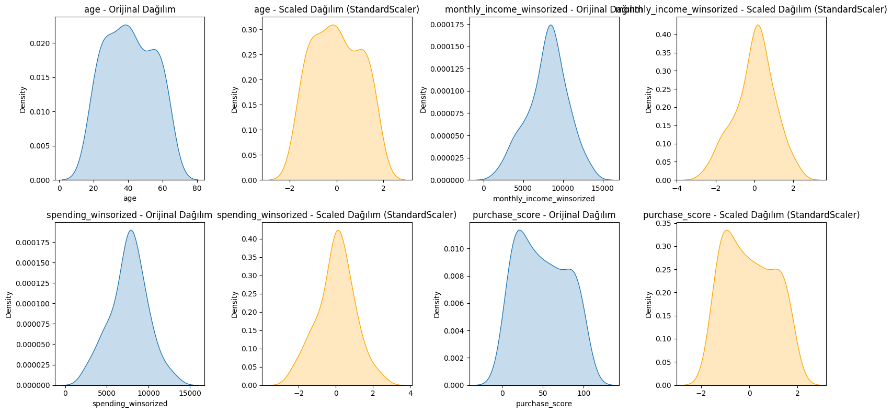

#  Makine Öğrenmesi ile Regresyon Modeli: Doğrusal Regresyon ve Random Forest Karşılaştırması

Bu proje, Yapay Zeka  Akademisi eğitimi kapsamında verilen 2. ödev çalışmasıdır. Çalışmada, bir veri seti üzerinde **keşifsel veri analizi (EDA)**, **veri ön işleme**, **özellik mühendisliği** ve **regresyon modelleme** adımları uygulanmıştır.

Projede, hem **Doğrusal Regresyon (Linear Regression)** hem de **Random Forest Regressor** algoritmaları kullanılmış ve model başarımları çeşitli metriklerle karşılaştırılmıştır.

---

## Proje İçeriği

### 1. Veri Analizi ve Temizleme
- Veri setinin genel yapısı incelenmiştir.
- Eksik veriler belirlenmiş ve uygun yöntemlerle doldurulmuştur (`SimpleImputer`, `mode`).
- Kategorik değişkenler `LabelEncoder` ile dönüştürülmüştür.
- Sayısal değişkenler `StandardScaler` ile ölçeklenmiştir.

### 2. Görselleştirme
- Dağılım grafikleri ve kutu grafikleri

#### Örnek: `monthly_income` değişkeninin Winsorizing Öncesi ve Sonrası Kutu grafikleri

#### Örnek: Sayısal Değişkenin Ölçeklendirme (Scaler) Öncesi ve Sonrası Dağılımı

### 3. Modelleme
- Veriler eğitim/test seti olarak ayrılmıştır.
- İki farklı model eğitilmiştir:
  - `LinearRegression`
  - `RandomForestRegressor`
- Modellerin başarıları aşağıdaki metriklerle değerlendirilmiştir:
  - RMSE (Root Mean Squared Error)
  - R² (Determination Coefficient)

### 4. Model Karşılaştırması

| Model                 | RMSE       | R² Skoru  |
|----------------------|------------|-----------|
| Doğrusal Regresyon   |3.0029     | -19.5713     |
| Random Forest        |0.0329     |  0.774   |

>  **Yorum**:  
> - Doğrusal regresyon modeli, veriye uyum sağlayamamış ve yüksek hata üretmiştir.  
> - Random Forest Regressor ise düşük hata ve yüksek açıklama gücü ile daha başarılı bir model performansı sergilemiştir.

---

## 🛠️ Kullanılan Kütüphaneler

- **Pandas** – Veri manipülasyonu
- **NumPy** – Sayısal işlemler
- **Matplotlib & Seaborn** – Görselleştirme
- **Scikit-learn (sklearn)** – Makine öğrenmesi, veri ön işleme, modelleme ve değerlendirme

---

